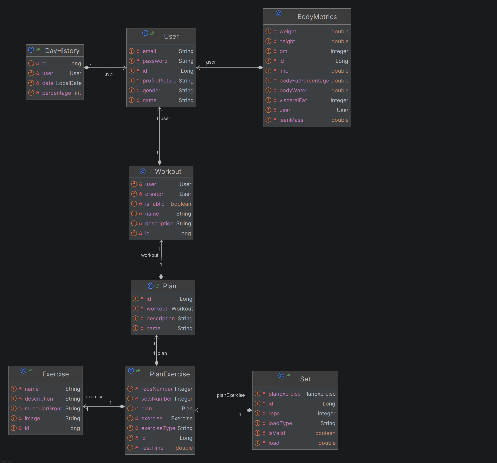

# Fit Streak API

Trabalho da disciplina **Desenvolvimento Backend (DCC208)**.

## Integrantes

- [Breno Furtado Rosado](https://github.com/C9BrenoFR)
- [Breno Machado](https://github.com/BrenoRMachado)

## Sobre o Projeto

Este é um projeto simples feito para ajudar a gerenciar e guardar informações do treino de musculação.
O foco é permitir o cadastro/autenticação do usuário, registro de métricas corporais e o gerenciamento de treinos (workouts, planos, exercícios e séries), mantendo históricos para acompanhamento e evolução.

## Diagrama de Classes

## Requisitos Funcionais

- **RF01 - Cadastro de Usuário:** O sistema deve permitir que novos usuários se cadastrem fornecendo nome, e-mail, sexo, telefone e senha, gerando automaticamente um código único de usuário para fins de busca social.
- **RF02 - Autenticação:** O sistema deve permitir que o usuário realize login para acessar seus dados.
- **RF03 - Registro de Métricas Corporais:** O sistema deve permitir que o usuário registre peso e altura, calculando automaticamente o IMC.
- **RF04 - Histórico de Evolução Corporal:** O sistema deve exibir o histórico das métricas registradas ao longo do tempo para acompanhamento da evolução física.
- **RF05 - Criar Estratégia de Treino:** O sistema deve permitir criar um "Workout" (ex: "Bulking 2024") que servirá como container para os planos diários.
- **RF06 - Montar Planejamento Diário:** O usuário deve poder criar planos dentro de um Workout (ex: Treino A, Treino B, Posterior de Coxa).
- **RF07 - Gerenciar Exercícios no Plano:** O sistema deve permitir adicionar, remover ou editar exercícios dentro de um plano específico.
- **RF08 - Configurar Metas de Exercício:** Ao adicionar um exercício, o usuário deve definir o tempo de descanso, número de séries pretendidas e a meta de repetições (aceitando valores como "6~8").
- **RF09 - Registro de Séries em Tempo Real:** Durante o treino, o sistema deve permitir o registro de cada série realizada, informando carga (peso ou número de placas), tipo de carga (libras, quilos ou placas) e repetições feitas.
- **RF10 - Classificação de Séries:** O usuário deve poder marcar se uma série foi "Válida" (série de trabalho/efetiva) ou "Inválida" (aquecimento ou feeder set).
- **RF11 - Cronômetro de Descanso Integrado:** Ao registrar uma série na tela de execução do exercício, o sistema deve disponibilizar um botão para iniciar um timer regressivo utilizando o tempo de descanso pré-configurado para aquele exercício.
- **RF12 - Progresso do Treino em Tempo Real:** A tela de execução do treino deve exibir a porcentagem de conclusão da sessão atual, calculada com base na proporção de séries válidas concluídas em relação ao número total de séries planejadas para o dia.
- **RF13 - Histórico de Cargas:** O sistema deve permitir visualizar o histórico de pesos e repetições de um exercício específico para monitorar a progressão de carga.
- **RF14 - Calendário de Frequência:** O sistema deve exibir um calendário interativo mostrando os dias em que o usuário treinou. Ao selecionar/clicar em um dia de treino, o sistema deve exibir a porcentagem de conclusão alcançada naquela sessão.
- **RF15 - Clonagem de Treinos:** Ao visualizar o Workout no perfil de um amigo, o sistema deve permitir que o usuário clone aquele treino para o seu próprio perfil com um único clique.
- **RF16 - Exportar Workout:** O sistema deve permitir gerar um arquivo (JSON ou YAML) contendo toda a estrutura de um Workout (Planos e Exercícios) para exportação externa.
- **RF17 - Importar Workout:** O sistema deve permitir que um usuário carregue um arquivo de treino externo e o adicione à sua lista de Workouts ativos.
